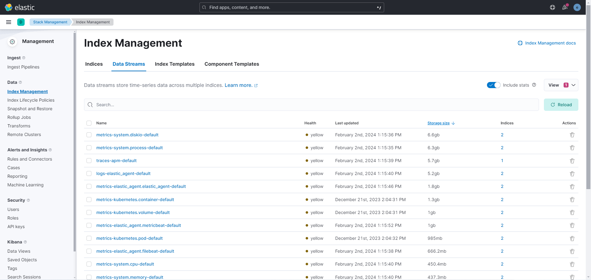

# ELK stack

## stack

- elastic
- kibana
- fleet
- apm server
- otel collector

### elastic

- Elasticsearch is an open-source distributed search and analytics engine built on top of Apache Lucene. It is developed by Elastic NV and is a core component of the Elastic Stack (formerly known as the ELK Stack), which also includes Logstash, Kibana, and Beats. Elasticsearch is designed to handle large volumes of data and provide fast, real-time search and analysis capabilities.

## Index Lifecycle Policies

Manages Disk

WARNING: Could not find logstash.yml which is typically located in $LS_HOME/config or /etc/logstash. You can specify the path using --path.settings. Continuing using the defaults
Could not find log4j2 configuration at path /usr/share/logstash/config/log4j2.properties. Using default config which logs errors to the console