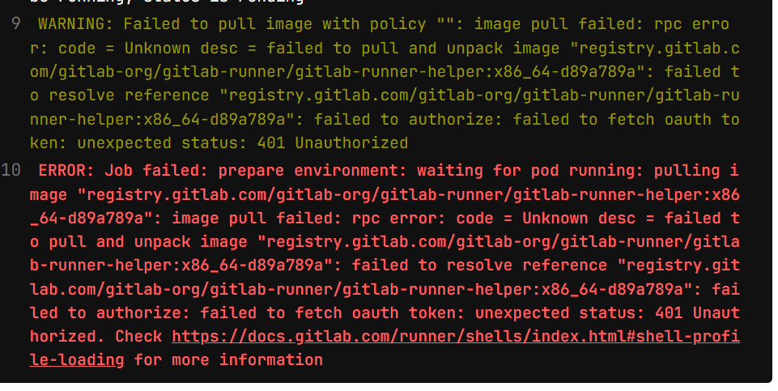

# Installation by helm

The GitLab chart is intended to fit in a cluster with at least 8 vCPU and 30 GB of RAM. If you are trying to deploy a non-production instance, you can reduce the defaults to fit into a smaller cluster.

## Using Static IP address

https://docs.gitlab.com/charts/installation/tools.html

## Deploy Gitlab By Helm

Set default storage class

```bash
kubectl patch storageclass zpool-ext4 -p '{"metadata": {"annotations":{"storageclass.kubernetes.io/is-default-class":"true"}}}'
```

If not set, will get this error.

```bash
Warning  FailedMount  5m23s (x2 over 5m25s)  kubelet            MountVolume.SetUp failed for volume "webservice-config" : failed to sync configmap cache: timed out waiting for the condition
Warning  FailedMount  5m23s (x2 over 5m25s)  kubelet            MountVolume.SetUp failed for volume "workhorse-config" : failed to sync configmap cache: timed out waiting for the condition
Warning  FailedMount  5m23s                  kubelet            MountVolume.SetUp failed for volume "init-webservice-secrets" : failed to sync secret cache: timed out waiting for the condition
```

Change `global.hosts.domain` to your domain.
If you use `gitlab.com`, you will get this `https://gitlab.gitlab.com`.
```bash
helm repo add gitlab https://charts.gitlab.io/
helm repo update
helm upgrade --install gitlab gitlab/gitlab \
  --timeout 600s \
  --set global.hosts.domain=sahatas.com \
  --set global.hosts.externalIP=10.111.0.117 \
  --set certmanager-issuer.email=sahatasnutlee@gmail.com \
#   --set postgresql.image.tag=13.6.0 \
  --set global.edition=ce \
  --set global.time_zone=Asia/Bangkok \
  --namespace gitlab
```

helm upgrade gitlab gitlab/gitlab \
    --set certmanager-issuer.email=sahatasnutlee@gmail.com \
    --set global.tls.enabled=false \
    --set global.edition=ce \
    --set global.hosts.domain=khaolakonline.com \
    --set global.time_zone=Asia/Bangkok \
    --set gitlab-runner.install=false \
    --namespace gitlab

Output

```bash
root@ansible-server:~# helm upgrade --install gitlab gitlab/gitlab \
>   --timeout 600s \
>   --set global.hosts.domain=sahatas.com \
>   --set global.hosts.externalIP=10.111.0.117 \
# >   --set certmanager-issuer.email=sahatasnutlee@gmail.com \
>   --set postgresql.image.tag=13.6.0 \
>   --set global.edition=ce \
>   --set global.time_zone=Asia/Bangkok
Release "gitlab" does not exist. Installing it now.
NAME: gitlab
LAST DEPLOYED: Mon Oct 23 17:09:29 2023
NAMESPACE: default
STATUS: deployed
REVISION: 1
NOTES:
=== CRITICAL
The following charts are included for evaluation purposes only. They will not be supported by GitLab Support
for production workloads. Use Cloud Native Hybrid deployments for production. For more information visit
https://docs.gitlab.com/charts/installation/index.html#use-the-reference-architectures.
- PostgreSQL
- Redis
- Gitaly
- MinIO

=== NOTICE
The minimum required version of PostgreSQL is now 13. See https://gitlab.com/gitlab-org/charts/gitlab/-/blob/master/doc/installation/upgrade.md for more details.

=== NOTICE
You've installed GitLab Runner without the ability to use 'docker in docker'.
The GitLab Runner chart (gitlab/gitlab-runner) is deployed without the `privileged` flag by default for security purposes. This can be changed by setting `gitlab-runner.runners.privileged` to `true`. Before doing so, please read the GitLab Runner chart's documentation on why we
chose not to enable this by default. See https://docs.gitlab.com/runner/install/kubernetes.html#running-docker-in-docker-containers-with-gitlab-runners
Help us improve the installation experience, let us know how we did with a 1 minute survey:https://gitlab.fra1.qualtrics.com/jfe/form/SV_6kVqZANThUQ1bZb?installation=helm&release=16-5

=== NOTICE
The in-chart NGINX Ingress Controller has the following requirements:
    - Kubernetes version must be 1.20 or newer (unless NGINX version is set
      to v1.2.1 via `nginx-ingress.controller.image.tag=v1.2.1`, which will
      restore Kubernetes 1.19 compatibility).
    - Ingress objects must be in group/version `networking.k8s.io/v1`.
```

Check Gitlab URL.

```bash
export GITLAB_HOSTNAME=$(kuexport GITLAB_HOSTNAME=$(kubectl get ingresses.extensions gitlab-unicorn \
    -o jsonpath='{.spec.rules[0].host}')
echo "Your GitLab URL is: https://${GITLAB_HOSTNAME}"
 
Your GitLab URL is: https://gitlab.35.225.196.151.xip.io
```

Ref.

```url
https://www.dbi-services.com/blog/deploy-gitlab-on-kubernetes-using-helm/
```
## Get Password

username: `root`

```bash
kubectl get secret gitlab-gitlab-initial-root-password -o jsonpath="{.data.password}" -n gitlab | base64 --decode ; echo
```

## Use Local DNS for poc

if you don't have DNS, you can use local dns.

on window `C:\Windows\System32\drivers\etc\hosts`

on linux `/etc/hosts`

add entries to the host files

```bash
10.111.0.117 gitlab.gitlab.com
10.111.0.117 kas.gitlab.com
10.111.0.117 minio.gitlab.com
10.111.0.117 registry.gitlab.com
```

## Install Gitlab-runner

```bash
# For Helm 2
helm install --namespace <NAMESPACE> --name gitlab-runner -f <CONFIG_VALUES_FILE> gitlab/gitlab-runner

# For Helm 3
helm install --namespace <NAMESPACE> gitlab-runner -f <CONFIG_VALUES_FILE> gitlab/gitlab-runner

helm install gitlab-runner-1 gitlab/gitlab-runner \
        --set gitlabUrl=https://gitlab.gitlab.com,runnerRegistrationToken=GR1348941TMXEu9v14fhLYjaLKSNh
```

Set gitlabUrl

```bash
helm upgrade --install gitlab-runner \
        --set gitlabUrl=https://gitlab.sahatas.com,runnerRegistrationToken=9WAVA85U347iFIrJnOG9pqucsX6SQwPwZBfpGWmUQ4AmQjOb5Ke0asyBTwCdYEri \
        gitlab/gitlab-runner
```

Example

```bash
helm upgrade gitlab-runner-1 \
        --set gitlabUrl=10.233.38.186:8181,runnerRegistrationToken=GR1348941TMXEu9v14fhLYjaLKSNh \
        gitlab/gitlab-runner
```

Example

```bash
helm upgrade --install -n gitlab gitlab-runner \
    --set gitlabUrl=http://gitlab-webservice-default.gitlab.svc.cluster.local:8080,runnerRegistrationToken=9WAVA85U347iFIrJnOG9pqucsX6SQwPwZBfpGWmUQ4AmQjOb5Ke0asyBTwCdYEri,rbac.create=true \
    gitlab/gitlab-runner 
```

```bash
helm upgrade --install -n gitlab gitlab-runner gitlab/gitlab-runner -f gitlab-runner-values.yaml
```

## Register Gitlab-runner Failed

```bash
Runtime platform                                    arch=amd64 os=linux pid=15 revision=d89a789a version=16.4.1
WARNING: Running in user-mode.
WARNING: The user-mode requires you to manually start builds processing:
WARNING: $ gitlab-runner run
WARNING: Use sudo for system-mode:
WARNING: $ sudo gitlab-runner...

Merging configuration from template file "/configmaps/config.template.toml"
WARNING: Support for registration tokens and runner parameters in the 'register' command has been deprecated in GitLab Runner 15.6 and will be replaced with support for authentication tokens. For more information, see https://docs.gitlab.com/ee/ci/runners/new_creation_workflow
ERROR: Registering runner... failed                 runner=5mxzLXfr status=couldn't execute POST against https://gitlab.gitlab.com/api/v4/runners: Post "https://gitlab.gitlab.com/api/v4/runners": dial tcp: lookup gitlab.gitlab.com on 169.254.25.10:53: no such host
PANIC: Failed to register the runner.
```

#### Solution

To resolve this error, have to edit deployment/gitlab-gitlab-runner like below.
Becouse we don't have DNS.

```bash
kubectl -n gitlab edit deployment/gitlab-gitlab-runner
```

Edit

```yaml
    - name: CI_SERVER_URL
      value: http://gitlab-webservice-default.gitlab.svc.cluster.local:8080
```

### Error Failed to pull image (Gitlab-runner)

```bash
WARNING: Failed to pull image with policy "": image pull failed: rpc error: code = Unknown desc = failed to pull and unpack image "registry.gitlab.com/gitlab-org/gitlab-runner/gitlab-runner-helper:x86_64-d89a789a": failed to resolve reference "registry.gitlab.com/gitlab-org/gitlab-runner/gitlab-runner-helper:x86_64-d89a789a": failed to authorize: failed to fetch oauth token: unexpected status: 401 Unauthorized
ERROR: Job failed: prepare environment: waiting for pod running: pulling image "registry.gitlab.com/gitlab-org/gitlab-runner/gitlab-runner-helper:x86_64-d89a789a": image pull failed: rpc error: code = Unknown desc = failed to pull and unpack image "registry.gitlab.com/gitlab-org/gitlab-runner/gitlab-runner-helper:x86_64-d89a789a": failed to resolve reference "registry.gitlab.com/gitlab-org/gitlab-runner/gitlab-runner-helper:x86_64-d89a789a": failed to authorize: failed to fetch oauth token: unexpected status: 401 Unauthorized. Check https://docs.gitlab.com/runner/shells/index.html#shell-profile-loading for more information
```



#### Solution

### Set Gitlab runner

```bash
=== NOTICE
You've installed GitLab Runner without the ability to use 'docker in docker'.
The GitLab Runner chart (gitlab/gitlab-runner) is deployed without the `privileged` flag by default for security purposes. This can be changed by setting `gitlab-runner.runners.privileged` to `true`. Before doing so, please read the GitLab Runner chart's documentation on why we
chose not to enable this by default. See https://docs.gitlab.com/runner/install/kubernetes.html#running-docker-in-docker-containers-with-gitlab-runners
```

```bash

```

### HTTP

| Name | Type | Default | Description |
| --- | --- | --- | --- |
| https	| Boolean	| true	| If set to true, you will need to ensure the NGINX chart has access to the certificates. In cases where you have TLS-termination in front of your Ingresses, you probably want to look at global.ingress.tls.enabled. Set to false for external URLs to use http:// instead of https. |
| tls.enabled	| Boolean	| true | When set to false, this disables TLS in GitLab. This is useful for cases in which you cannot use TLS termination of Ingresses, such as when you have a TLS-terminating proxy before the Ingress Controller. If you want to disable https completely, this should be set to false together with global.hosts.https

```yml
# values.yaml
global:
  ingress:
    annotations:
      "nginx.ingress.kubernetes.io/ssl-redirect": "false"
```

### Disable TLS Verification
https://gitlab.com/gitlab-org/gitlab-runner/-/issues/36895
1. 
  ```bash
  openssl s_client -showcerts -connect {your.gitlab.hostname}:443 -servername {your.gitlab.hostname} < /dev/null 2>/dev/null | openssl x509 -outform PEM > {your.gitlab.hostname}.crt
  ```

  ```bash
  openssl s_client -showcerts -connect gitlab.khaolakonline.com:443 -servername gitlab.khaolakonline.com < /dev/null 2>/dev/null | openssl x509 -outform PEM > gitlab.khaolakonline.com.crt
  ```

2. Create secret


  ```bash
  kubectl create secret generic gitlab-cert-name \
    --namespace <NAMESPACE> \
    --from-file={your.gitlab.hostname}.crt
  ```

  ```bash
  kubectl create secret generic gitlab-cert \
    --namespace gitlab \
    --from-file=gitlab.khaolakonline.com.crt
  ```

3. In runner values.yaml

  ```bash
  certsSecretName: gitlab-cert-name
  ```

### Namespace remove stuck

```bash
(
NAMESPACE=gitlab
kubectl proxy &
kubectl get namespace $NAMESPACE -o json |jq '.spec = {"finalizers":[]}' >temp.json
curl -k -H "Content-Type: application/json" -X PUT --data-binary @temp.json 127.0.0.1:8001/api/v1/namespaces/$NAMESPACE/finalize
)
```

```
root@ansible-server:~# kubectl api-resources --verbs=list --namespaced -o name | xargs -n 1 kubectl get --show-kind --ignore-not-found -n gitlab
NAME                                                                            STATE     DOMAIN                       AGE
challenge.acme.cert-manager.io/gitlab-gitlab-tls-vt6r4-1330819766-2392614702    pending   gitlab.khaolakonline.com     3h2m
challenge.acme.cert-manager.io/gitlab-kas-tls-hmk2f-600222928-2177299830        pending   kas.khaolakonline.com        5h12m
challenge.acme.cert-manager.io/gitlab-minio-tls-vqjr8-2852618193-2582324073     pending   minio.khaolakonline.com      5h12m
challenge.acme.cert-manager.io/gitlab-registry-tls-mt79k-2903392422-127572445   pending   registry.khaolakonline.com   5h12m
```