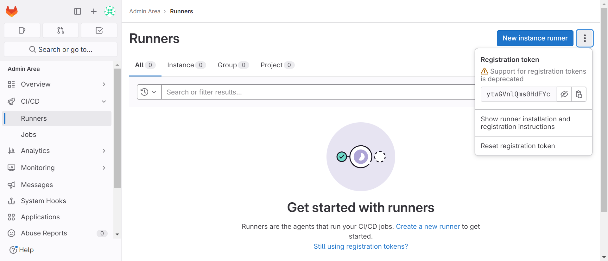

# Gitlab Runner

## Install

```bash
# For Helm 2
helm install --namespace <NAMESPACE> --name gitlab-runner -f <CONFIG_VALUES_FILE> gitlab/gitlab-runner

# For Helm 3
helm install --namespace <NAMESPACE> gitlab-runner -f <CONFIG_VALUES_FILE> gitlab/gitlab-runner

helm install gitlab-runner-demo gitlab/gitlab-runner -n gitlab \
        --set gitlabUrl=http://gitlab.khaolakonline.com \ 
        --set runnerRegistrationToken=ytwGVnlQms0HdFYcDA17ELWMPRUV0lctJMLyvXFOaQPAteAlFa8t85bzglqldtdV \
        --atomic \
        --debug \
        --timeout 120s 

helm install gitlab-runner-demo gitlab/gitlab-runner -n gitlab \
        --set gitlabUrl=http://gitlab.khaolakonline.com \ 
        --set runnerToken=glrt-vxGrMxJNSM-prEwtgQSH \
        --atomic \
        --debug \
        --timeout 120s

helm install gitlab-runner-demo gitlab/gitlab-runner -n gitlab --atomic --debug --timeout 120s -f values.yaml

helm install gitlab-runner-1 gitlab/gitlab-runner -n gitlab -f <CONFIG_VALUES_FILE>
```

## Registration Token

`admin area` > `runner` 



```
kubectl -n gitlab exec -it po gitlab-runner-1-c658f85c8-tbgvf -- /bin/bash
```

## Runner Token

`admin area` > `runners` > `new instance runner` > `create runner`

```bash
gitlab-runner register  --url http://gitlab.khaolakonline.com  --token glrt-vxGrMxJNSM-prEwtgQSH
```

## Register Gitlab-runner Failed

```bash
Runtime platform                                    arch=amd64 os=linux pid=15 revision=d89a789a version=16.4.1
WARNING: Running in user-mode.
WARNING: The user-mode requires you to manually start builds processing:
WARNING: $ gitlab-runner run
WARNING: Use sudo for system-mode:
WARNING: $ sudo gitlab-runner...

Merging configuration from template file "/configmaps/config.template.toml"
WARNING: Support for registration tokens and runner parameters in the 'register' command has been deprecated in GitLab Runner 15.6 and will be replaced with support for authentication tokens. For more information, see https://docs.gitlab.com/ee/ci/runners/new_creation_workflow
ERROR: Registering runner... failed                 runner=5mxzLXfr status=couldn't execute POST against https://gitlab.gitlab.com/api/v4/runners: Post "https://gitlab.gitlab.com/api/v4/runners": dial tcp: lookup gitlab.gitlab.com on 169.254.25.10:53: no such host
PANIC: Failed to register the runner.
```

### Solution

To resolve this error, have to edit deployment/gitlab-gitlab-runner like below.
Becouse we don't have DNS.

```bash
kubectl -n gitlab edit deployment/gitlab-gitlab-runner
```

Edit

```yaml
    - name: CI_SERVER_URL
      value: http://gitlab-webservice-default.gitlab.svc.cluster.local:8080
```

## Self sign certificate

```bash
# create cert
openssl s_client -showcerts -connect gitlab.khaolakonline.com:443 -servername gitlab.khaolakonline.com < /dev/null 2>/dev/null | openssl x509 -outform PEM > gitlab.khaolakonline.com.crt

# create secret
kubectl create secret generic gitlab-cert --namespace gitlab --from-file=gitlab.khaolakonline.com.crt
```
